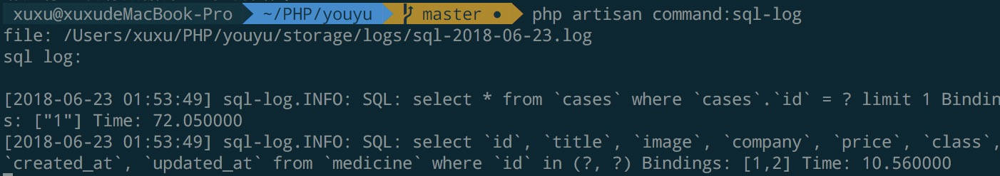

偶尔会用 Laravel 开发一些小东西玩，不过每次做相关数据库查询代码的时候，看不到某个接口或者页面执行了那些 SQL 会没有安全感（laravel-debugbar 还是有点重），所以一般我都会写一个小工具来实时查看，下面就是小工具的完整代码（在 Laravel5.6 版本之上）。

第一件事是需要写一个 SQL 的日志服务提供者：

```PHP
<?php

namespace App\Providers;

use App;
use Log;
use DB;
use Illuminate\Support\ServiceProvider;
use Monolog\Formatter\LineFormatter;
use Monolog\Handler\RotatingFileHandler;
use Monolog\Logger;

class SqlLogServiceProvider extends ServiceProvider
{
    public function boot()
    {
        if (App::environment() == 'local') {

            $log = new Logger('sql-log');

            //默认保留十天的sql日志
            $log->pushHandler((new RotatingFileHandler(
                $this->app->storagePath().'/logs/sql.log', 10, Logger::INFO
            ))->setFormatter(new LineFormatter("[%datetime%] %channel%.%level_name%: %message%\n")));

            DB::listen(function ($query) use ($log) {
                $log->info(sprintf("SQL: %s Bindings: %s Time: %f",
                    $query->sql, json_encode($query->bindings), $query->time
                ));
            });
        }
    }
}
```

注册服务提供者：

```PHP
'providers' => [
     //...
     App\Providers\SqlLogServiceProvider::class,
],
```

再写一个日志 tail 命令：

```PHP
<?php

namespace App\Console\Commands;

use Illuminate\Console\Command;
use App;
use Monolog\Handler\RotatingFileHandler;

class SqlLog extends Command
{
    protected $signature = 'command:sql-log';

    protected $description = 'debug sql log';

    public function __construct()
    {
        parent::__construct();
    }

    public function handle()
    {
        $file = App::storagePath() . '/logs/sql-'. date(RotatingFileHandler::FILE_PER_DAY) . '.log';
        if (file_exists($file)) {
            echo "file: ". $file . "\n";
            echo "sql log: \n\n";
            system("tail -f " . $file);
        } else {
            echo "请运行一次有数据库查询的操作。\n";
        }
    }
}
```

在 `Kernel.php`文件中注册命令：

```PHP
protected $commands = [
    SqlLog::class,
];
```

在 Laravel 项目为 local 环境的时候，请求一次带有 SQL 查询的路由，在执行以下命令就可以 tail 日志了：

```shell
php artisan command:sql-log
```

效果如下：


