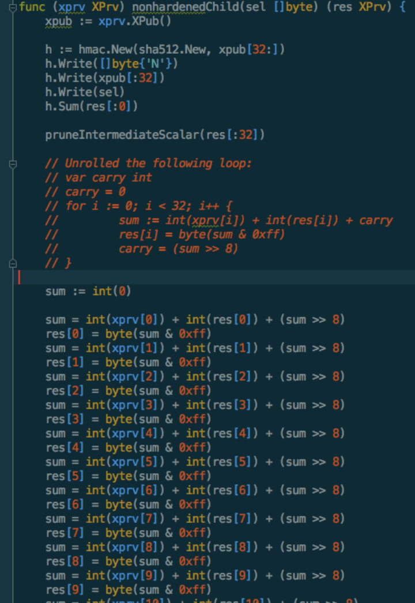

以Bytom公链为例：

公钥私钥的生成：ed25519 椭圆曲线算法：

1. 常见的 RSA 非对称加密技术：对一极大整数做质因数分解是很困难的一件事
2. 椭圆曲线算法：利用椭圆曲线的几何性质，安全性更高（具体为啥需要数学大神解释一下）（[Wiki](https://en.wikipedia.org/wiki/EdDSA) 维基百科介绍，目前椭圆曲线算法被广泛的应用在区块链技术的公私钥生成上）
3. RSA 数学原理通俗讲义：[YouTube](https://www.youtube.com/watch?v=D_kMadCtKp8)
4. 为什么量子计算可以让区块链生态瓦解？（假如实现了 128 个量子比特纠缠，并且其能制造成计算机，那么他的计算能力理论上是普通计算机的 2 的 128 次方倍，*这个是通过视频自我理解的*）通俗讲义：[YouTube](https://www.youtube.com/watch?v=BzyOoo4AOxs)
5. 随机私钥 Byte 数组 → 通过某些计算以符合 ed25519 的私钥规则 → 调用 ed25519 算法的 `GeScalarMultBase` 计算公钥

## 私钥的存储：AES 加密

1. 我们使用钱包交易的时候，输入的密码是什么？
   1. 密码就是加密存储私钥的 AES 密码

## 一个钱包的构架大致是什么样子的？

1. 余额是怎么计算的（UTXO 模型，非以太坊账户模型，通过各 Bytom 技术人员交流得来的，并不见得所有的都是这样）
   1. 类似于计数器模式，服务器会汇总旧的区块中相关账户的金额（并不会计算所有地址的余额，而是相关的，比如你注册了某个钱包）
   2. 区块链网络每生成一个新的区块，服务器会拿到区块信息，解析数据，并把相关的账户余额变更同步到传统数据库相应的账户上
2. 实际上钱包后端也是传统的互联网架构
3. 私钥是本地加密存储的
4. 助记词究竟是什么？
   1. 可以理解成私钥生成的随机因子，助记词和私钥是完全等价的，两者可以通过函数对称转换

## 钱包在浏览器端实现的一些坑

1. JS 似乎没有很好的 ed25519 实现
2. 钱包的 SDK（生成钱包的 key，加密存储，账户管理）工作量没有想象的那么少，大量的代码都是加密算法的调用和 Byte 数组级别的计算
3. 下面截图是子私钥派生的一个函数，云里雾里，对加密算法不理解根本无从下手
4. 基本上 JS 代码实现所有的 SDK 功能相当于把 Bytom 源码的相关账户部分的加密算法实现照抄（不懂加密算法的原理，照抄实现是很痛苦的一件事）

解决方案：

1. Wasm
2. 编译命令 `GOOS=js GOARCH=wasm go build -o main.wasm`
3. Wasm 是 go 的实验性特性，可能会有 bug，一旦有问题解决起来恐怕会很困难。
4. Wasm 和 JS 交互演示

如果你对钱包技术感兴趣，可以关注这个 Github，所有 Bytom 钱包的代码都会开源在这里：[Bytom-Community](https://github.com/Bytom-Community)
