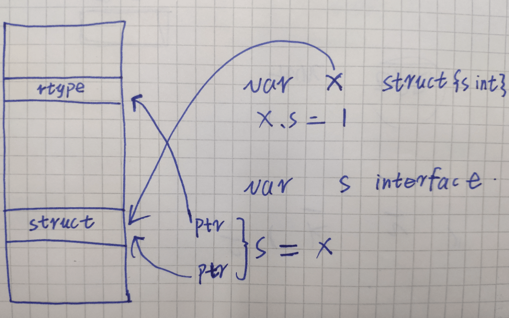

## 内存结构

Go 自带 GC、反射机制，在内存中的数据结构必然会有额外的数据结构，来记录这些额外的信息。

初探端倪：buildin new 函数（内存分配器 `runtime/malloc.go`）：

new 一个变量的时候，实际上编译器会将我们传入的变量转换成 `_type` 这个结构，`mallocgc` 函数会分配内存空间，返回结构体的指针。

## 反射机制

假如我们通过反射函数获取当前这个变量的类型。

当前变量的类型信息记录在 `kind` 这个值内，反射机制只需要简单的找到这个 `_type` 结构体就可以拿到其属性信息。

其他反射信息同理，只要借助反射包中的逻辑顺藤摸瓜，就会发现别有洞天，比如结构体字段的名字，你只需要探究一下就会发现这个字符串存储在哪里（不再探讨了）。

如何才能拿到这个 `_type` 信息呢？

## 自己实现一个简易的类型反射函数

`interface` 类型数据结构入手。

输出：

## 总结

实际上，反射是编译器帮助我们把各种类型、结构体的 meta 信息存储到一个位置，我们调用反射接口的时候，反射包会去相应的位置查找这些 meta 信息。

反射究竟对性能影响有多大？

反射慢就慢在过程中涉及到大量的变量创建，内存分配是一个很耗费性能的活（看似一个 `new` 函数很简单，但是逻辑很复杂，逻辑参照 `newobject` 函数，所以对性能要求较高的场景一般都会使用 `sync.pool`，`gin` 中的 `ctx` 就是例子）

反射很好用，该用就用，只有不大量使用（类似于 json 解析里面的那样），性能损耗有限。

你是不是能顿悟出来类型断言的原理了？
