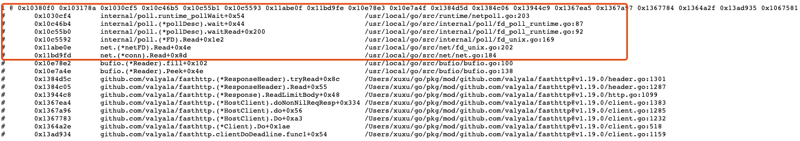

## 起因

近期由于新上的一个系统新版本出现了 bug，现象是某个 HTTP 接口会在接受一定量请求之后 hang 住，伴随着产生了大量调用方的超时报警。由于新上的系统不是面向用户的系统，所以要求运维保留现场，关掉了触发问题请求的任务，开始排查问题。

最后找到问题的原因很简单：sqlx 库使用了 `Queryx` 方法，查询由于只是判断记录是否存在，所以并没有读取返回的 Rows，这就导致了一个问题，就是数据库连接不会被释放回池子里，由于设置了最大连接数，所以导致接口被 hang 死。

这里也有了一个教训，无论是什么级别的系统，还是在测试环境多跑跑。

言归正传，今天要讨论的主题并不是这个低级错误。在修复完 bug 之后，由于之前的服务一直保留现场，所以修复的代码打包完成后直接在公司内部的 k8s 平台操作上线了，这时产生了一个诡异的现象，突然之间收到了大约三千多个请求，似乎是之前被 hang 住的请求被复活一样。

这就诡异了。

接下来就是搞清楚这个问题，比较担心是某些未知的 bug 导致的。

## 问题探究

我先从这三千多个请求中随机挑选了几个，由于每个请求都有 TraceId，所以直接去请求方日志中搜寻，发现这些请求的确是在故障发生时候请求的，并且还有请求超时的错误信息。在服务修复之后上线重启的时间段，并没有对应的请求日志。

由于有请求服务的代码权限，所以直接拉取代码，想直接在代码中找找线索。排查过程中发现，调用方服务 HTTP 请求是使用的 fasthttp 库，代码也很简单，核心逻辑如下：

```go
fasthttp.DoTimeout(req, resp, time.Second)
```

代码中设置了超时时间，隐约的感觉这个问题应该和 fasthttp 库有关。接下来就是看一下 fasthttp 的代码，果然发现了一处重试逻辑：
[client.go#L1231](https://github.com/valyala/fasthttp/blob/v1.19.0/client.go#L1231)

```go
for {
  retry, err = c.do(req, resp)
  if err == nil || !retry {
    break
  }

  if hasBodyStream {
    break
  }
  if !isRequestRetryable(req) {
    if err != io.EOF {
      break
    }
  }
  attempts++
  if attempts >= maxAttempts {
    break
  }
}
```

当服务重启的时，`c.do()` 返回 `retry=true，err=io.EOF`，fasthttp 会触发重试逻辑。当再次重试的时候，可能已经请求到重启之后的服务了，这里要说一下，这个过程在本地不是特别好复现，一般情况下，k8s 都是滚动发布，先拉起新的服务，服务探活正常，然后会把依次把旧的服务下线，旧服务下线时，调用方会收到 io.EOF。新的服务注册到负载均衡或者服务发现上，也就是平滑重启，所以这个时候 fasthttp 进行 retry 直接请求到正常服务上。

`do()` 函数内部产生 `retry=true，err=io.EOF` 返回结果的位置代码逻辑如下：
[client.go#L1383](https://github.com/valyala/fasthttp/blob/v1.19.0/client.go#L1383)

```go
br := c.acquireReader(conn)
if err = resp.ReadLimitBody(br, c.MaxResponseBodySize); err != nil {
  c.releaseReader(br)
  c.closeConn(cc)
  retry := err != ErrBodyTooLarge
  return retry, err
}
```

实际上，每个请求都会阻塞在 `ReadLimitBody`，也就是读取服务端响应数据的这行，直到服务重启。这个时候就如上面所说的，触发重试逻辑。

之所以会阻塞直到服务端重启，是因为没有设置连接的 `ReadTimeout`（TCP 的超时设置），默认情况下，fasthttp 这个选项是 0，也就是没有限制，会无限等待下去。但是如果这里设置了 ReadTimeout 的时间，其实还是会重试，只是会在重试超过 `maxAttempts`（默认为 5） 次数之后退出请求。如果不想进行重试，需要设置 `fasthttp.Client` 的 `RetryIf` 函数。

关于设置 `ReadTimeout` 的问题 fasthttp 在 `DoTimeout` 方法上也有相关的注释：

```go
// Warning: DoTimeout does not terminate the request itself. The request will
// continue in the background and the response will be discarded.
// If requests take too long and the connection pool gets filled up please
// try using a Client and setting a ReadTimeout.
```

## Go HTTP 标准库的重试逻辑

之后我也简单研究了一下标准库的重试逻辑，代码位置在：
[transport.go#L661](https://github.com/golang/go/blob/release-branch.go1.15/src/net/http/transport.go#L661)

Go 标准库会在如下情况下进行重试：

1. http2 相关，具体参考 [issues/16582](https://github.com/golang/go/issues/16582)
2. 请求是可重试的并且 Transport 在读取 Response 第一个 byte 的时候出错
3. 请求是可重试的并且 Transport 新建立的 TCP 链接在没有请求的情况下返回了 io.EOF 或者读取到了 HTTP 408，这部分逻辑在：[transport.go#L2186](https://github.com/golang/go/blob/release-branch.go1.15/src/net/http/transport.go#L2186)

上述后面两点主逻辑代码在 `persistConn.readLoop` 函数内：
[transport.go#L2005](https://github.com/golang/go/blob/release-branch.go1.15/src/net/http/transport.go#L2005)

标准库对于可重试的定义代码：
[request.go#L1392](https://github.com/golang/go/blob/release-branch.go1.15/src/net/http/request.go#L1392)

## goroutine 泄漏问题

如果 HTTP 请求未设置 TCP 级别读取或者写入的超时时间，读取或者写入的 goroutine 便会永远阻塞，无法被复用，这时候如果有新请求会建立新的连接，也算是产生 goroutine 泄漏。

请求库的超时设置本质上只是库级别的一个 timer，不对下层 TCP 起作用。

**但是标准库并不会产生泄漏问题**，当请求超时的时候，标准库会直接关闭 TCP 链接，这部分代码在：
[transport.go#L2608](https://github.com/golang/go/blob/release-branch.go1.15/src/net/http/transport.go#L2608)、
[transport.go#L2656](https://github.com/golang/go/blob/release-branch.go1.15/src/net/http/transport.go#L2656)

fasthttp 就没用这么幸运了，并没有这个机制，所以 fasthttp 只能通过设置 TCP 的超时来解决。

fasthttp 被阻塞的 goroutine：



## 最后

相关版本

* fasthttp 版本：v1.19.0
* go 版本：1.15

问题定位工具&思路：

* 使用 `net/http/pprof` 查看 goroutine 信息，确定是否存在泄漏，并且可查看 stack
* 通过以上方法确认标准库没有泄漏，首先通过 Wireshark 抓取 Loopback 网卡数据包，过滤端口定位是客户端在超时之后关闭了 TCP 链接（发送了 FIN 帧）
* 给标准库 `http.Client` 设置自定义的 `http.Transport`，Transport 内设置的 `DialContext` 返回的 `net.Conn` 继承重写了 `Close` 方法，重写的 `Close` 打上断点，方便调试定位代码位置（HTTP 标准库代码实在是太多了。。）
