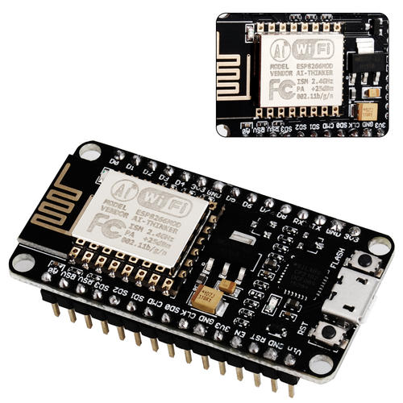
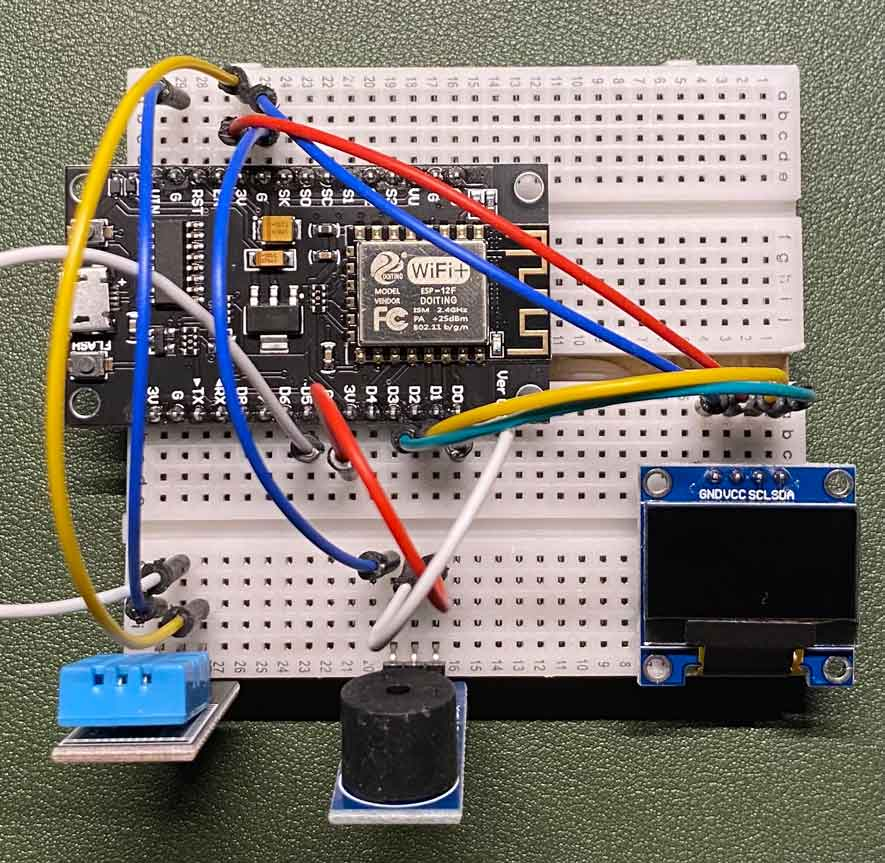
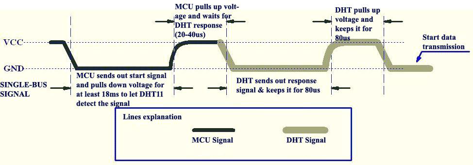

前一段时间突发奇想想做一个硬件。

需求是这样的：在老家一般太阳能加水都是使用水泵抽到房顶，当水满的时候，关掉水泵的电源。
这样其实显得不够自动化，每次还要人看着，如果有一个硬件能控制，那可真是太棒了，哈哈。从硬件的实现角度来讲也很简单：就是通过水位的变化控制水泵的开关。

**注意，接下来的硬件提到到继电器，严肃提示：:warning:高压危险:warning:**！

## 硬件选型

作为一名软件工程师，从来没有研究过嵌入式领域。一开始想到的就是非常出名的树莓派，但是成本比较高，杀鸡用牛刀。

经过一番探索，一个物美价廉的产品出现：[**ESP8266**](https://www.espressif.com/zh-hans/products/socs/esp8266)。这个小东西十几块钱就能从某宝上买到，而且还是一块带有 WIFI 功能的 [MCU](https://en.wikipedia.org/wiki/Microcontroller)。
由我国的乐鑫科技设计。



ESP8266 只是芯片的名称，我们买到的基本上都是一块设计好的开发板，有开发用的引脚，还有已经集成好的和开发计算机交互用的串口芯片等等。

当然如果会 PCB 设计，也可以自己设计，把需要的元器件、传感器设计到一个 PCB 上，这样就不需要使用线材连接传感器到这种通用开发板，显得不是很优雅。

聊到开发板，就不得不提 [Arduino](https://www.arduino.cc/)。Arduino 是一个开源的电子原型平台，包括各种型号的 Arduino 的开发板、嵌入式开发用的 Arduino IDE。
通过 Arduino IDE ，可以很方便的和各种传感器交互（库很丰富，而且 Arduino 环境对硬件抽象的也很好）。不过 Arduino 的开发板比 ESP8266 十几块的价格贵，幸运的是 ESP8266 也支持在 Arduino 环境下开发。
接下来的开发也都是在这个环境下。

最终本次需求的硬件是：

* 水位传感器（Water Sensor）
* 继电器
* 升压模块（继电器工作电压是 5v，ESP8266 供电引脚为 3.3v）
* ESP8266 开发板
* 连接线
* 万用表（测试电路通断，测量升压模块输出电压）

当然为了玩，还买了其他的传感器，例如温湿度传感器、单色 LCD 显示器、蜂鸣器等。

## 预备

在准备为芯片编程之前，还是需要了解一些嵌入式开发的基础知识。
先上一张开发板的引脚图：


图中的引脚 `3.3v`、`GND`（负极）是供电引脚，为传感器供电，有一些传感器要求是 5v，这个时候就要连接升压模块才能使传感器正常工作。
我们将开发板的引脚和传感器的引脚使用线材相连，为了方便，也可以使用面包板。

引脚中最多的就是 [GPIO](https://zh.wikipedia.org/wiki/GPIO) 了，可以通过这个引脚接收和输入数据（电位高低）和传感器交互。GPIO 接收的是数字信号，也就是 0 或者 1，左上角的 ADC0 引脚可以接收模拟信号，取值范围为 0 ~ 1023。



## 开发环境

开发环境使用 Arduino，网上可以很容易找到 ESP8266 在 Arduino 环境的配置，这里就不再介绍了，打开 Arduino IDE，将开发板和电脑通过 USB 相连，就可以进行开发了。

这里额外说一下，要想电脑识别到开发板，需要安装对应开发板串口芯片的驱动才行，买的时候商品上面有标识，如果没有的话可以看一下
Micro USB 接口附近的芯片，一般靠近最大的就是，我的芯片是 CH340，直接 Google 关键词就可以找到驱动了。

## 编码

Arduino 对硬件的抽象非常简单，我们只要使用 C/C++ 语言对两个函数编程就可以了。一个是初始化函数 setup，在硬件上电或者重置的时候运行一次，这个函数内可以进行连接 WIFI，启动一个精简的 web 服务器等等操作。另外的 loop 函数相当于 main 函数，只不过这个函数会被无限循环调用，这个函数编写主逻辑。

```cpp
void setup() {
  // put your setup code here, to run once:
}

void loop() {
  // put your main code here, to run repeatedly:
}
```

比如要获取水位传感器的数据，只需要这么写就 ok 了：

```cpp
void setup() {
  pinMode(12, INPUT); // 设置 GPIO12 为 INPUT 模式，GPIO12 对应的是 D6 接口，水位传感器的信号线自行连接的位置
  pinMode(LED_BUILTIN, OUTPUT); // 开发板自带的 LED 灯设置为 OUTPUT 模式
}

void loop() {
  // 这些主逻辑就比较简单了，当水位传感器为 LOW 信号时候，则没有水
  // 这时候设置 LED 灯熄灭（LED 灯高电平为熄灭信号）
  // 反之亦然
  if( digitalRead(12) == LOW) {
      digitalWrite(LED_BUILTIN, HIGH);
  } else {
      digitalWrite(LED_BUILTIN, LOW);
  }
  // 休眠 50ms
  delay(50);
}
```

由于 GPIO 为数字信号，无法读取此传感器的模拟信号（水位高低），如果要读取水位高低的模拟信号，需要将传感器信号线连接至 ADC0 模拟信号针脚，代码改写如下：

```cpp
void setup() {
  // 打开串口通讯，波特率设置 115200，这样就可以通过串口监视器查看数据，其实就是编程的控制台
  Serial.begin(115200);
}

void loop() {
  // 读取模拟信号针脚 A0 数据，输出到串口
  // 当然由于水位传感器的精度问题，这个也并不是很准。
  int val = analogRead(A0);
  Serial.println(val);
  delay(50);
}
```

所以最终需求代码很简单，就不演示了。综合来讲就是当水位传感器检测到水，控制继电器断开就完成了，当然你也可以加入更复杂的功能，例如当断开的时候蜂鸣器鸣叫，每天定时接通电源等等。不过还是要注意安全，继电器是需要连接 220v 市电的。

无论是水位传感器还是继电器、LED 灯、蜂鸣器只需要简单控制电位高低就可以控制了，但是还有一些比较复杂的传感器，比如温湿度传感器、OLED mini 显示屏等等，这些就比较麻烦了。

## 深入了解

先来看读取温湿度传感器数据的 Demo：

```cpp
#include <dhtnew.h>

DHTNEW mySensor(5);

void setup()
{
  Serial.begin(115200);
}

void loop()
{
  mySensor.read();
  Serial.print(mySensor.getHumidity(), 1);
  Serial.print("\n");
  Serial.print(mySensor.getTemperature(), 1);
  Serial.print("\n");
  delay(1000);
}
```

直接使用 [dhtnew](https://github.com/RobTillaart/DHTNEW) 库读取温湿度信息即可。库帮助我们封装了和传感器交互的协议，所以在这里看到的就很简单。接下来深入一下和传感器的交互协议。这里使用的传感器为 DHT11，下图为和传感器的交互时序：



综合来讲，就是 MCU 将对应的数据针脚按照这个时序输出，就会收到传感器对应的数据回应。

大致流程为 MCU 下拉至少 18ms，然后再拉高 20-40μs，如果没问题，传感器会先拉低电位约 80μs，之后拉高 80μs，接下来传感器就开始传输 40bit 的温湿度数据了。

这部分逻辑在库中的 `_readSensor` 函数中：

```cpp
int DHTNEW::_readSensor()
{
  // ...
  pinMode(_dataPin, OUTPUT);
  digitalWrite(_dataPin, LOW);
  delayMicroseconds(_wakeupDelay * 1100UL);
  digitalWrite(_dataPin, HIGH);
  delayMicroseconds(2);
  pinMode(_dataPin, INPUT_PULLUP);
  // 接下来就是读取 40bit 数据的代码
}

```

最后数据 “0” 和 “1” 的判别是：

* 0 为 50μs 的低电平和 26-28μs 的高电平
* 1 为 50μs 的低电平和 70μs 的高电平

对应代码为：

```cpp
for (uint8_t i = 40; i != 0; i--)
{
  if (_waitFor(HIGH, 70)) return DHTLIB_ERROR_TIMEOUT_C;
  // 26-28 us ==> 0
  //    70 us ==> 1
  uint32_t t = micros();
  if (_waitFor(LOW, 90)) return DHTLIB_ERROR_TIMEOUT_D;
  if ((micros() - t) > DHTLIB_BIT_THRESHOLD)
  {
    _bits[idx] |= mask;
  }
  mask >>= 1;
  if (mask == 0)
  {
    mask = 0x80;
    idx++;
  }
}
```

除了这些协议，还有一些通用的协议，就和软件世界的 HTTP 协议一样，硬件世界里例如 I2C 协议，和小显示器通讯就是使用这个协议，不过我们也不用自己实现复杂的时序输出，一般都有库实现。

在软件的世界里，协议可能是约定好的 JSON 格式，或者二进制的 bit，而在硬件的世界里，协议就是电位的高低，持续时间这些参数。

## NonOS 和 RTOS

在 Arduino 环境下，ESP8266 的 SDK 是基于官方的 NonOS SDK 制作的，可以理解为运行在芯片上的只是程序并没有操作系统的概念，官方的说法是：Non-OS SDK 主要使⽤定时器和回调函数的⽅式实现各个功能事件的嵌套，达到特定条件下触发特定功能函数的目的。

另外还有基于 FreeRTOS 的版本，FreeRTOS 是一个开源的，嵌入式的实时操作系统，是一个简要结构的系统，可以理解为系统和应用程序都会打包运行在内核态。

由于单片机的性能有限，所以一些基础应用例如文件系统、内存管理一般都是专门开发的，比如 Arduino 环境下的 SDK 内存管理器是使用的 [umm_malloc](https://github.com/rhempel/umm_malloc)，还有文件系统 [littlefs](https://github.com/littlefs-project/littlefs)。

## 参考资料

* [https://github.com/esp8266/Arduino](https://github.com/esp8266/Arduino)
* [https://lastminuteengineers.com/water-level-sensor-arduino-tutorial/](https://lastminuteengineers.com/water-level-sensor-arduino-tutorial/)
* [https://www.mouser.com/datasheet/2/758/DHT11-Technical-Data-Sheet-Translated-Version-1143054.pdf](https://www.mouser.com/datasheet/2/758/DHT11-Technical-Data-Sheet-Translated-Version-1143054.pdf)
* [https://www.w3cschool.cn/arduino/arduino_water_detector_sensor.html](https://www.w3cschool.cn/arduino/arduino_water_detector_sensor.html)
