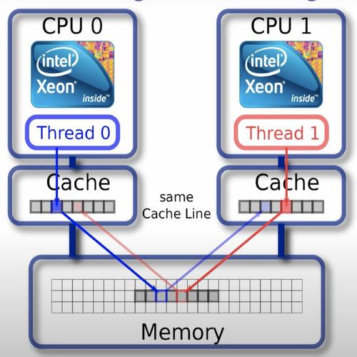

在设计程序、算法、数据结构方面，了解基础的硬件设计构造和知识，有助于帮助我们设计良好性能的程序。同时还能为我们解决问题提供新的思考方向。

以下 Go 性能测试代码，涉及到和硬件相关的问题：

```go
type CacheLinePad struct{ _ [64]byte }

type testPad struct {
	A uint32
	_ CacheLinePad
}

type testNoPad struct {
	A uint32
}

func BenchmarkA(b *testing.B) {
	var va testPad
	var vb testPad
	b.RunParallel(func(pb *testing.PB) {
		for pb.Next() {
			atomic.AddUint32(&va.A, 1)
			atomic.AddUint32(&vb.A, 1)
		}
	})
}

func BenchmarkB(b *testing.B) {
	var va testNoPad
	var vb testNoPad
	b.RunParallel(func(pb *testing.PB) {
		for pb.Next() {
			atomic.AddUint32(&va.A, 1)
			atomic.AddUint32(&vb.A, 1)
		}
	})
}
```

上述性能测试，BenchmarkA 约为 20 ns/op，BenchmarkB 约为 35 ns/op。A 和 B 的性能测试唯一的区别就是结构体中是否嵌入了一个没有实际意义的 pad 结构，这造成了不小的性能差距。当然这种差距在业务中一般都不会去优化，对于业务很多都是重 IO 操作，这种优化不会有效果，而且会造成额外的认知和操作成本。但是如果是底层库比如 Go 的 runtime、算法一般情况下都会注意这种情况。

这种情况被叫做伪共享（false sharing），和 CPU 内部的高速缓存硬件结构有关。

需要注意的是，这种性能差距只有使用原子操作的时候才会明显，Go 中通过原子包，其他语言可能则可能是 volatile 这种关键字。

## 什么是伪共享

CPU 内部有 L1、L2 以及 L3 高速缓存，这些高速缓存据空间局部性原理会缓存当前访问内存位置的整个缓存行，一般这个缓存行的大小是 64 字节，也就是说，CPU 不是只缓存当前操作的内存位置，例如一个变量大小的区域，而是会复制整个的连续区域到高速缓存内。



这个时候如果多个核心持有相同的缓存行，核心 1 操作修改了内容，其他核心就需要做额外的事情保证缓存行数据的一致性。从程序上看，就是两个变量距离“很近”，在一个缓存行，如果多核心并发操作这两个看似没有竞争关系的变量，实际上在 CPU 层级会产生大量的核心之间的协调工作，来保证缓存一致性。

如何规避这种问题？就是引入代码中的 pad 结构，强制保持各个核心持有不同的缓存行。当然这是用牺牲内存空间的代价来换取的。空间换时间。程序设计上，pad 结构会保持和 CPU 缓存行大小一致。

## 为什么要使用原子操作

接上话，Go 使用原子操作的时候这个性能差距才会变得明显。

CPU 通过 [MESI](https://zh.wikipedia.org/wiki/MESI%E5%8D%8F%E8%AE%AE)(modified，exclusive，shared，invalid) 缓存一致性协议保证各个缓存的一致性。当前 CPU 核心的 cache 修改后，会通过协议交互，保持相同 cache line 的数据在其他核心中是一致的。但是这个交互并不是实时的，CPU 为了优化性能，设计了缓冲：store buffer 和 invalidation queues。


所以如果不用原子操作，当前 CPU cache line 失效的信号是被 buffer 的，并不会实时强制保持各个核心一致。

原子操作一般是使用 LOCK 指令实现的，LOCK 指令在 intel 手册内描述如下（[英特尔® 64 位和 IA-32 架构开发人员手册：卷 2A 639页](https://www.intel.cn/content/www/cn/zh/architecture-and-technology/64-ia-32-architectures-software-developer-vol-2a-manual.html)）：

> In a multiprocessor environment, the LOCK# signal ensures that the
> processor has exclusive use of any shared memory while the signal is asserted.

LOCK 指令会保持采用锁定缓存或者总线的方式保证内存强制一致，当前核心独占使用共享的内存区间，同时，store buffer 和 invalidation queues 中的数据会被强制刷写，参见：

* [8.1.4 Effects of a LOCK Operation on Internal Processor Caches 261页](https://www.intel.cn/content/www/cn/zh/architecture-and-technology/64-ia-32-architectures-software-developer-vol-3a-part-1-manual.html)
* [11.10 STORE BUFFER 434页](https://www.intel.cn/content/www/cn/zh/architecture-and-technology/64-ia-32-architectures-software-developer-vol-3a-part-1-manual.html)

## Java 中的 volatile 关键字

Java 中要想复现伪共享的问题，则需要对变量增加 volatile 关键字。这一点和 Go 使用原子操作类似，Go 没有类似 volatile 的关键字，只有原子相关操作的库。

```java
class Pointer {
    volatile long x;
    volatile long y;
}
```

Java 中使用 volatile 关键字可以保证变量的可见性和有序性，读、写操作的原子性，这需要对编译器重排和 CPU 指令重排有限制措施（内存屏障），需要注意的是，它只会保证简单的读写，并不会保证自增这种操作，自增是一个 [Read–modify–write](https://en.wikipedia.org/wiki/Read%E2%80%93modify%E2%80%93write) 的操作。volatile 关键词在汇编层面上，也是使用 LOCK 指令实现的。

这里你可能会疑惑，同样是使用 LOCK 实现，为什么 Java 不保证自增这种类型的操作？其实这可以理解为 Java 对于 volatile 关键词的定义，是不包含这些的，编译器层面或者 JVM 层面也只是实现保证 Load 和 Store。是语言设计的问题。

其他的，LOCK 指令为什么可以实现诸如限制 CPU 指令重排这些功能，可以参阅下面的资料和 intel 开发人员手册 LOCK 对应的内容。CPU 通常有其他指令（例如 MFENCE 指令）来保证这一功能，但是其他指令一般情况下性能不如 LOCK 好，所以语言实现一般都使用 LOCK。

参考出自：[Instruction selection for volatile fences : MFENCE vs LOCK:ADD](https://blogs.oracle.com/dave/instruction-selection-for-volatile-fences-%3a-mfence-vs-lock%3aadd)
>In the past the JVM has used MFENCE but, because of latency issues on AMD processors and potential pipeline issues on modern Intel processors it appears that a LOCK:ADD of 0 to the top of stack is preferable.

## 一些细节问题

* 原子操作中的 Load 语义并没有特殊指令，源码只是常规的读取
  
  `runtime/internal/atomic/atomic_amd64.go`:

  ```go
  func Load(ptr *uint32) uint32 {
    return *ptr
  }
  ```

  这一部分猜测是，原子操作中的写，修改操作都是用原子指令保证了一致性，读的时候内存已经是一致的内存了，直接读取即可。当然这个应该是和 CPU 架构相关的，不同架构做法也不同，所以这个语义肯定会存在。
  可以参考 ARM 架构和 AMD64 结构关于原子指令的实现，代码上，ARM 实现要复杂的多，且 Load 不是简单的读取内存。

* Go GMP 结构中，P 结构就存在 pad，避免伪共享
  
  `runtime/runtime2.go`:

  ```go
  type p struct {
    // ...
    pad cpu.CacheLinePad
  }
  ```
  
  GMP 中只有 P 结构有 pad，别的没有，待深究。

## 一些遗留问题

* 内存对齐和高速缓存之间的关联
* intel 官方文档中未找到 invalidation queues 和 LOCK 指令之间的关系的叙述
* Go 中的内部包 `internal/cpu` 中关于指令集检测的结构体没有原子相关操作，也使用 pad 结构规避了伪共享
  
  这里有两个猜测：
  1. 虽然自身没有原子操作，但是可能自身被嵌入到别的结构体中，别的结构体内有原子操作
  2. CPU 的 buffer 设计也是有大小的，满之后肯定还是会刷写，所以单个操作只有在原子操作下才会明显，如果将操作放大，同时不使用原子操作，那么性能依然有差距，Demo 如下：
  
  ```go
  type CacheLinePad struct{ _ [64]byte }

  type testPad struct {
    A uint32
    _ CacheLinePad
  }

  type testNoPad struct {
    A uint32
  }

  const loop = 1_000_000
  func BenchmarkA(b *testing.B) {
    var va testPad
    var vb testPad
    b.RunParallel(func(pb *testing.PB) {
      for pb.Next() {// 单次操作循环 100w 次，不使用原子操作
        for i := 0; i < loop; i++ {
          va.A++
          vb.A++
        }
      }
    })
  }

  func BenchmarkB(b *testing.B) {
    var va testNoPad
    var vb testNoPad
    b.RunParallel(func(pb *testing.PB) {
      for pb.Next() {
        for i := 0; i < loop; i++ {
          va.A++
          vb.A++
        }
      }
    })
  }
  ```
  
  这其中性能测试 A 约为 16000000 ns/op，B 约为 22000000 ns/op。

## 参考资料

* [深入理解原子操作的本质](https://www.cnblogs.com/orlion/p/14318553.html)
* [缓存一致性协议的工作方式](https://zhuanlan.zhihu.com/p/123926004)
* [内存屏障的来历](https://zhuanlan.zhihu.com/p/125549632)
* [Volatile 底层原理详解](https://zhuanlan.zhihu.com/p/133851347)
* [杂谈 什么是伪共享（false sharing）？](https://zhuanlan.zhihu.com/p/65394173)
* [Java 内存模型和 Volatile](https://novoland.github.io/%E5%B9%B6%E5%8F%91/2014/07/26/Java%E5%86%85%E5%AD%98%E6%A8%A1%E5%9E%8B.html)
* [Volatile Vs Atomic](https://stackoverflow.com/questions/19744508/volatile-vs-atomic)
* [Principle analysis of volatile and lock in java](https://ofstack.com/Java/25575/principle-analysis-of-volatile-and-lock-in-java.html)
* [聊聊 CPU 的 LOCK 指令](https://albk.tech/%E8%81%8A%E8%81%8ACPU%E7%9A%84LOCK%E6%8C%87%E4%BB%A4.html)
* [Go and CPU Caches](https://teivah.medium.com/go-and-cpu-caches-af5d32cc5592)
* [Elimination of False Cache Line Sharing](https://www.youtube.com/watch?v=h58X-PaEGng)
