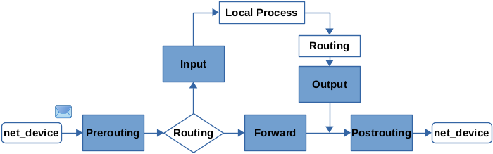

**本文不是教程，只做纯技术讨论和问题过程记录与解决。**

当前居住地用来上网的机器是一个刷了梅林固件的远古网件路由器，奈何性能和稳定性差，内置的软件也已经没人维护了，很多需求都无法满足，遂准备整备一下当前网络环境。根据以往经验，大思路是路由器只是单纯的使用原厂固件做好本职工作，例如提供 WIFI 以及有线连接，其他特殊需求通过一台 7*24 小时开机的机器（服务器）完成。

## 机器选择

经过简单的调研，机器的选择大致分为几种：

| 机器               | 运行模式           |     性价比     | 稳定性 |
| :---------------------: | :------------------: | :----------: | :---------------------: |
| Mac mini                | 旁路网关               |     土豪     | 人民币解决方案，强 |
| 淘宝 x86 软路由（工控机）   | 主路由模式（ESXi 虚拟机） |     略贵     | 未知，不知道是哪里代工的，不清楚这个行业 |
| 淘宝 ARM 软路由           | 主路由模式（OpenWrt）   |     还行     | 同上 |
| 树莓派等 ARM 主机         | 旁路网关               |     还行     | 一般 |
| 闲鱼二手 x86 mini 主机    | 旁路网关               | 便宜贵的都有   | 看人品 |
|  品牌小主机，例如 NUC      |旁路网关                |略贵           | 一般 |

上述之所以树莓派和 NUC 稳定性一般，主要原因是坑较多，得自己折腾，软件一般情况下都是开源的，会有一些 Bug，不如 Mac 系统下直接花钱买 Surge 简单，纯人民币解决方案。

另外选择非专用此场景的机器时候需要考虑一下功耗，上面的 Mac mini M1 芯片低负载情况下也只有 6-7w 的功耗，较为省电。

有些 ARM  的机器例如树莓派 CPU 不支持 AES 指令集，这个就有些致命，某些软件对 AES 加密需求要求很高，所以这种机器在使用过程中 CPU 占用会高一些，有可能出现跑不满带宽的情况。

综合价格和可玩性，最后买来树莓派折腾，毕竟折腾不成还能搞点别的（最近芯片短缺，树莓派的价格已经贵太多了）。

## 网络规划

由于使用树莓派，所以树莓派运行在旁路网关模式下，系统选择使用 Ubuntu（OpenWrt 成熟方案，功能基本上被限定在软路由这一块了，可玩性差一些）。

> PS：后来换成官方的 Debian 系统了，Ubuntu 系统未知原因随机重启，猜测可能和温度有关。

网络环境内所有的主机网关和 DNS 均指向树莓派的 IP。这样所有的流量都会经过路由器到达树莓派进行处理（一般情况下，对于局域网的请求不会，系统路由表对于当前局域子网流量直接走二层交换，可以在路由表内看到局域网流量网关为 0.0.0.0）。

网络拓扑如下：


对于路由器来讲，配置工作比较简单，在树莓派配置完成之后，将其 DHCP 服务的 DNS 和网关配置成树莓派 IP 即可。接下来主要的工作都集中在树莓派上。

要想树莓派代理全局流量，就需要树莓派有软件可以接管处理 OSI 分层模型中网络层或者数据链路层的数据。大部分软件实现全局代理也都是相同的思路，通过系统接口例如 TUN 虚拟网络设备处理接管这一层的流量。

## TUN 设备

TUN  设备的解释参考 WIKI：[TUN与TAP](https://zh.wikipedia.org/wiki/TUN与TAP)。

简单来讲，TUN 设备是一个虚拟设备，并且可以和用户态绑定的程序通讯以处理网络数据包。这个时候问题就来了：由于代理软件工作在四层，要想处理 TUN 网络层的数据包，并经过协议栈解析拼装成对应四层数据例如 TCP、UDP 数据，这就需要对协议栈了解，相当于是重新实现了内核这部分的功能并跑在用户态。当然，肯定已经有人帮我们造好了轮子并无私的放在了 Github 上，例如 [google/gvisor](https://github.com/google/gvisor)。

在用户态，把网络层数据解析成四层协议数据，软件就可以通过规则，例如分析目标 IP 的地理归属，将需要特殊处理的流量代理到目标服务器。

这里其实有个小问题，四层流量只能拿到 IP 地址，某些软件是支持根据域名、域名后缀来匹配规则，如何根据 IP 拿到域名呢？同时，IP 也可能会对应多个域名。其实这里有一个重点，就是软件也可以拿到局域网的 DNS 请求，通过一系列的黑魔法记录这层关系，例如 Fake IP 等，就可以实现这个功能。这里不再展开。可以看看参考文献中的文章：浅谈在代理环境中的 DNS 解析行为。

所以在这种环境中，如果是使用 Fake IP 模式，则你的域名都会被解析到保留地址中，例如 198.18.0.0/16。

## 系统网络设置

接下来就要设置系统网络将需要处理的流量正确的转发到 TUN 设备并交给软件处理。同样，已经有大佬写好了脚本：[setup-tun.sh](https://github.com/Kr328/clash-premium-installer/blob/master/scripts/setup-tun.sh)。这个脚本使用的是 nftables 命令来设置，nftables 和 iptables 一样，都是管理系统网络数据包的处理过滤、分类和转发。Linux 3.13 版本之后这部分的内核实现已经替换成了 nftables，但是保留了对于 iptables 命令的兼容支持。

设置完成的 TUN 设备流量示意图：


主要原理是将物理网卡接收的数据包（局域网内其他设备的外网流量）在 prerouting hook 以及本机（Ubuntu）程序的数据包在 output hook 处打上标记，路由到 TUN 设备交给代理软件处理。

nftables hook 示意图：



在开源的脚本中，本机数据包的标记工作 `chain local` 和局域网流量的 `chain forward` 不太一样。本机使用的是：

```shell
ct state new ct mark set $NETFILTER_MARK
ct mark $NETFILTER_MARK mark set $NETFILTER_MARK
```

其主要区别是，本机通过 `ct state new` 区分出新建立的流量并打上标记，表现为代理软件启动之前连接不受到影响。虽然 nftables 工作在网络层是无状态的，但还是可以通过分析网络包来判断流量状态，例如 TCP 中的 SYN。

配置完成之后，启动软件，一切大功告成。

## 其他问题解决

### DHCP 设置问题

由于路由器配置 DHCP 将网关和 DNS 指向了树莓派，树莓派在同样的网络中，但是树莓派的网关需要指向路由器，所以树莓派上需要关闭 DHCP，手动设置网关，自己的 IP 以及 DNS。

### 流量回环问题、绕过代理原理

需要使用 cgroup 解决流量回环问题，同样，其他软件也可以使用这种方式绕过代理软件。

关联 nftables 配置：

```shell
meta cgroup $BYPASS_CGROUP_CLASSID accept
```

### 局域网设备 ping 不通外网 IP 问题

局域网内在配置旁路网关之后，会出现 ping 不同外网 IP 的情况，主要是经过树莓派的非 TCP/UDP 流量未做 NAT。这种情况如果不处理可能会造成某些软件无法正常工作。

这里需要具体分析一下流量的路径（假设 ping 8.8.8.8）：

1. ping icmp 数据包流量从局域网某台机器发出，由于网关设置的是树莓派，经过路由器交换，到达树莓派
   * 此时路由器工作在二层，起到交换机的作用
   * 被发送到树莓派的数据包组成为：
     * 源 MAC 地址、源 IP 不会改变，为发送机器的 MAC 和 IP
     * 目标 MAC 地址为树莓派 MAC，目标 IP 为 8.8.8.8
2. 树莓派根据 nftables 配置，将非 TCP/UDP 流量正常路由发送到路由器
   * 由于树莓派此时工作在三层，所以送往路由器的数据包会发生改变：
     * 源 MAC 地址被替换成树莓派的，源 IP 不会改变还是发送机器的 IP
     * 目标 MAC 地址为路由器 MAC，目标 IP 为 8.8.8.8

第 2 步就出现了问题，路由器会直接将这种的数据包丢弃。与此关联的内核参数是 rp_filter。

数据包到达路由器后，路由器获取当前数据包的源 IP，并查看自己的路由表检查是否与发送到此 IP 的数据包的 interface 相同，相同则继续处理，否则丢弃。显然，由于工作在旁路网关模式，可以简单理解为，这个数据包路由器认为是不需要经过树莓派，所以不通过检验。解决这个问题一般是两个方案，一个是更改路由器 rp_filter 参数，一个是数据包在经过树莓派时，将源 IP 更改为树莓派 IP，也就是 NAT。路由器是没有入口更改这个参数，所以在树莓派上使用 nftables 配置 NAT 即可：

```shell
chain masquerade-cfg {
	type nat hook postrouting priority 0; policy accept;
		
	ip saddr 192.168.31.0/24 oif eth0 masquerade
}
```

这样 IP 就被替换成树莓派的 IP，可正常 ping 通。

当 ping 的回复数据包回到树莓派时，树莓派查询自己的 NAT 表，将目标 IP 替换成原 IP，即可将数据包通过路由器的交换，送达正在 ping 的机器。

以上参考自：

[When RHEL has multiple IPs configured, only one is reachable from a remote network. Or why does RHEL ignore packets when the route for outbound traffic differs from the route of incoming traffic?](https://access.redhat.com/solutions/53031)

> Strict filtering means that when a packet arrives on the system, the kernel takes the source IP of the packet and makes a lookup of its routing table to see if the interface the packet arrived on is the same interface the kernel would use to send a packet to that IP. If the interfaces are the same then the packet has passed the strict filtering test and it is processed normally. If the interfaces are not the same then the packet is discarded without any further processing

内核配置文档：[ip-sysctl.txt](https://www.kernel.org/doc/Documentation/networking/ip-sysctl.txt)

## 参考文献

* [iptables - 维基百科](https://zh.wikipedia.org/wiki/Iptables)
* [第 47 章 nftables 入门 Red Hat Enterprise Linux 8](https://access.redhat.com/documentation/zh-cn/red_hat_enterprise_linux/8/html/configuring_and_managing_networking/getting-started-with-nftables_configuring-and-managing-networking)
* [Nftables - Packet flow and Netfilter hooks in detail](https://thermalcircle.de/doku.php?id=blog:linux:nftables_packet_flow_netfilter_hooks_detail)
* [浅谈在代理环境中的 DNS 解析行为](https://blog.skk.moe/post/what-happend-to-dns-in-proxy/)
* [Conntrack tales - one thousand and one flows](https://blog.cloudflare.com/conntrack-tales-one-thousand-and-one-flows/)
* [Matching connection tracking stateful metainformation - nftables wiki](https://wiki.nftables.org/wiki-nftables/index.php/Matching_connection_tracking_stateful_metainformation#Matching_conntrack_metadata)
* [Setting packet metainformation - nftables wiki](https://wiki.nftables.org/wiki-nftables/index.php/Setting_packet_metainformation)
* [rp_filter - Understanding the reverse path filter in Linus for your LPIC-3](https://www.theurbanpenguin.com/rp_filter-and-lpic-3-linux-security/)
