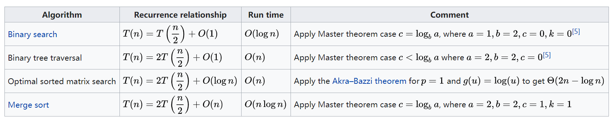
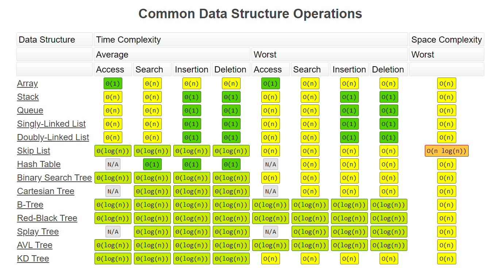
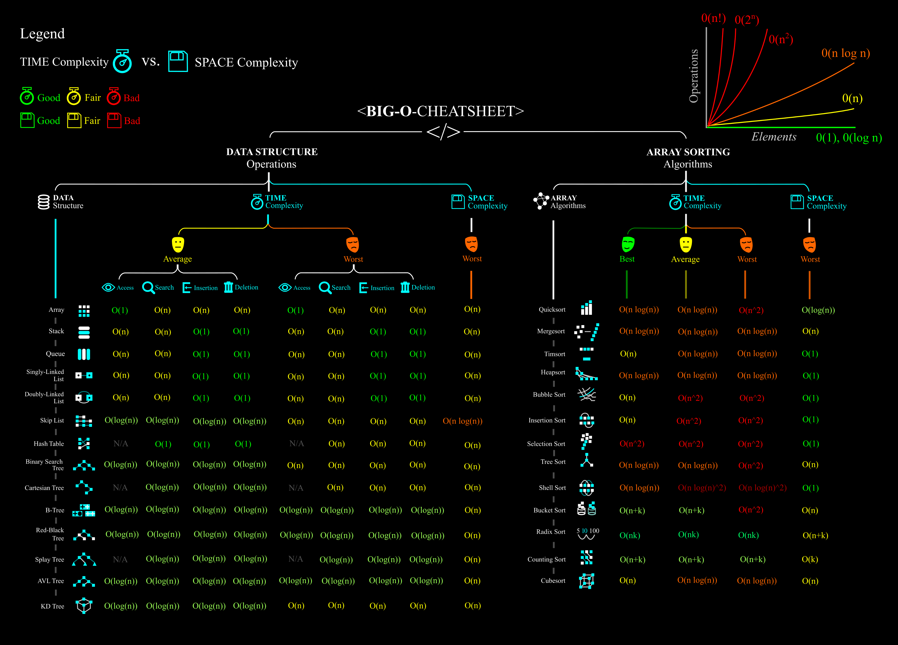

# 《算法面试通关40讲》

之前也尝试刷过算法，但是一段时间之后就不继续了，现在找了一个比较功利的算法练习课程，再从头到尾刷一遍试试看。

笔记记录的方法为先看一遍课程，然后再练习、整理记录。

[[toc]]

## 02 | 如何事半功倍地学习算法与数据结构

书籍：《异类 —— 不一样的成功启示录》

学习方法：

* Chunk it up（切碎知识点，基本组成，基础之前的链接）
* Deliberate practicing（**刻意练习，练习缺陷，弱点，不舒服的点**）
* Feedback（获得反馈）

规范化练习思路，切题四件套

* Clarification（明确，审题，搞懂意思）
* Possible solutions（可能的所有解题方案）
  * compare(time/space)
  * optimal(加强）
* Coding（多写）
* Test cases

## 03 | 如何计算算法的复杂度

### Data Structure

* Array
* Stack / Queue
* PriorityQueue (heap) 优先级队列（堆）
* LinkedList (single / double)
* Tree / Binary Tree 二叉树
* Binary Search Tree 二叉搜索树
* HashTable
* Disjoint Set 并查集
* Trie 前缀树
* BloomFilter 布隆过滤器
* LRU Cache

### Algorithm

* General Coding
* In-order/Pre-order/Post-order traversal 前、中、后序遍历
* Greedy 贪心算法
* Recursion/Backtrace 递归/回溯
* Breadth-first search 广度优先
* Depth-first search 深度优先
* Divide and Conquer 分治
* Dynamic Programming 动态规划
* Binary Search 二分查找
* Graph 图

### 主定理（master theorem）



## 04 | 如何通过LeetCode来进行算法题目练习

* 做题之前先思考解法，并且知道对应的时间复杂度
* 看别人的解法，反馈的过程

## 05 | 理论讲解：数组&链表

### 数组

* 查询时间复杂度 O(1)
* 插入的时间复杂度最坏情况为 O(n)，平均值为 O(n/2)
* 删除的时间复杂度同上

### 链表

* head、tail 头尾
* 特殊的：单独存储头尾指针
* 插入删除时间复杂度为 O(1)，查找为 O(n)

## 06 | 面试题：反转一个单链表&判断链表是否有环

[reverse-linked-list](https://leetcode-cn.com/problems/reverse-linked-list/)

```go
/**
 * Definition for singly-linked list.
 * type ListNode struct {
 *     Val int
 *     Next *ListNode
 * }
 */
func reverseList(head *ListNode) *ListNode {
    var next *ListNode
    for head != nil {
        // 思路：当前节点的 next 换成上一个的指针，同时需要一个变量 next 缓存上一个指针
        // 每次循环记录当前节点指针到缓存变量中
        // 这里交换涉及到中间变量，这么想会比较简单，先进行交换，发现交换的值需要使用，再使用 tmp 缓存下来
        // 例如 当前 next 换成之前缓存的，那么 head.Next = next
        // head.Next 是下一个节点，是有用的，所以在这之前定义 tmp := head.Next 
        // 这么想不容易闹混
        tmp := head.Next 
        head.Next = next
        next = head
        head = tmp
    }
    return next
}
```

相关习题：

* [reverse-linked-list](https://leetcode-cn.com/problems/reverse-linked-list/)
* [swap-nodes-in-pairs](https://leetcode-cn.com/problems/swap-nodes-in-pairs/)
* [linked-list-cycle](https://leetcode-cn.com/problems/linked-list-cycle/)
* [linked-list-cycle-ii](https://leetcode-cn.com/problems/linked-list-cycle-ii/)

解法提示：

* map
* 快慢指针

## 07 | 理论讲解：堆栈&队列

* Stack 栈 先进先出 FIFO
* Queue 队列 先进后出 FILO

使用数组或者链表实现均可。

常见数据结构时间复杂度（来源 [https://www.bigocheatsheet.com/](https://www.bigocheatsheet.com/)）：



来源：[Big O Cheat Sheet](https://www.deviantart.com/assyrianic/art/Big-O-Notation-Cheat-Sheet-762169573)



## 08 | 面试题：判断括号字符串是否有效

[valid-parentheses](https://leetcode-cn.com/problems/valid-parentheses)

Go 使用数组实现 stack 要点：

```go
// pop
stack = stack[:len(stack) - 1]
// peak
stack[len(stack)-1]
// push
stack = append(stack, v)
```
